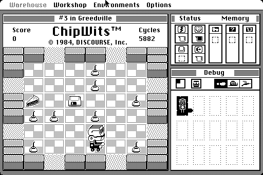
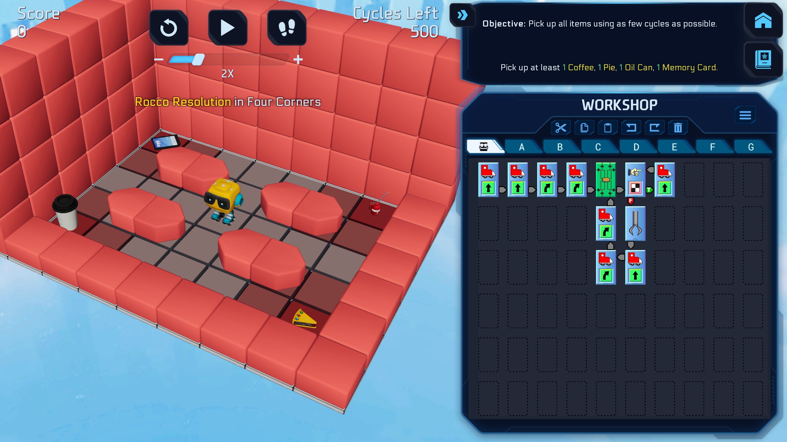
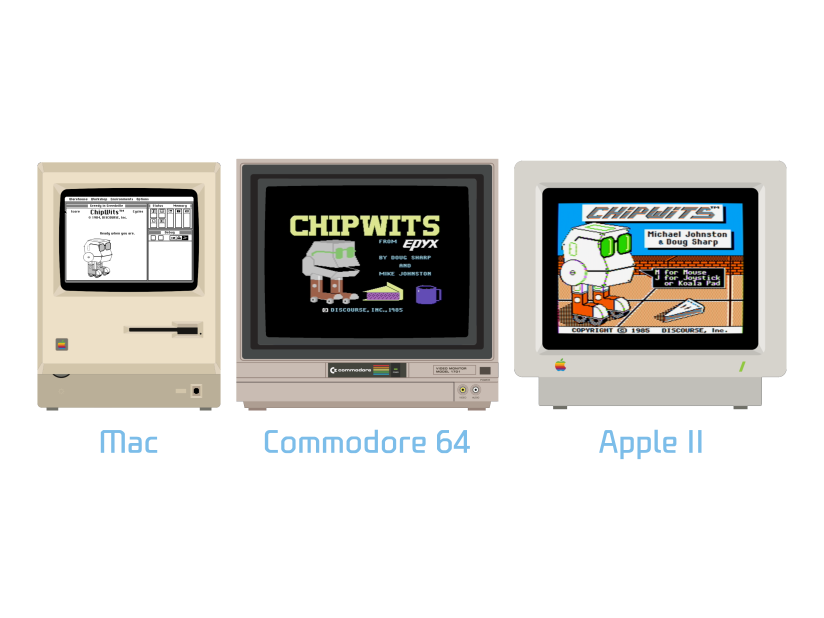

# ChipWits-FORTH

This repository contains raw disk images from the archives of the original author of
ChipWits, Doug Sharp. The disks contain the original FORTH source code for ChipWits, as well
as other related files.

For the 40th anniversary of ChipWits (which was released the same year as the original
Macintosh), ChipWits, Inc. released the source code for the game to the public. The team
hopes that this will inspire a new generation of programmers to learn about FORTH and
how many games were programmed in the 1980s.

# What is ChipWits?

From the manual:

> ChipWits is a game where you program robots to explore rooms and mazes filled with different
> kinds of objects. As you learn how to make the robots "think" for themselves, you will sharpen
> your problem-solving skills and learn some of the basic principles of computer programming.

ChipWits was originally released in 1984 for the Macintosh, and later ported to the Commodore 64
and Apple II in 1985. It was created by Doug Sharp and Mike Johnston, and has inspired many
programmers and game developers over the years.

# What is FORTH?

FORTH is a stack-based programming language that was popular in the 1970s and 1980s,
especially for 8-bit microcomputers and embedded systems. It is known for its simplicity
and flexibility, and is still used in some applications today.

You can find out more about FORTH here: https://en.wikipedia.org/wiki/Forth_(programming_language)

# Editions

There are two editions of ChipWits in this repository:

- [Mac Edition](mac/README.md)
- [Commodore 64 Edition](c64/README.md)

The source code for the Apple II edition has not yet been recovered.

# Manuals

This repository also contains scans of the original manuals and box art for ChipWits:

* [Mac ChipWits Manual](docs/ChipWits_Mac_Manual.pdf)
* [Commodore 64 ChipWits Manual](docs/ChipWits_C64_Manual.pdf)
* [Apple II ChipWits Manual](docs/ChipWits_Apple_II_Manual.pdf)

# ChipWits Reboot

ChipWits is currently being rebooted by ChipWits, Inc., a game company led by Doug Sharp and
Mark Roth. You can find out more about the reboot and play the free demo here:

Wishlist on Steam: https://store.steampowered.com/app/2330720/ChipWits/?utm_source=github 

Website: https://chipwits.com/

This repository does not have any assets related to the remake.

# ChipWits in Emulation

The Mac, Commodore 64 and Apple II versions of the game can all be played in
emulation on the ChipWits website: https://chipwits.com/retro

# Future Work

At the moment, the Commodore 64 edition is runnable. The Mac edition should be runnable
as well but has not yet been demonstrated to work.

We're looking for help to recover more of the source code and assets for ChipWits. If you have
expertise in FORTH, we would love to hear from you. Please join the
[ChipWits Discord](https://discord.com/invite/D4G3np9RWm) or email us at
[github@chipwits.com](mailto:github@chipwits.com) to get in touch.

# License

All the work in this repository is licensed as follows:

Shield: [![CC BY-SA 4.0][cc-by-sa-shield]][cc-by-sa]

This work is licensed under a
[Creative Commons Attribution-ShareAlike 4.0 International License][cc-by-sa].

[![CC BY-SA 4.0][cc-by-sa-image]][cc-by-sa]

[cc-by-sa]: http://creativecommons.org/licenses/by-sa/4.0/
[cc-by-sa-image]: https://licensebuttons.net/l/by-sa/4.0/88x31.png
[cc-by-sa-shield]: https://img.shields.io/badge/License-CC%20BY--SA%204.0-lightgrey.svg
