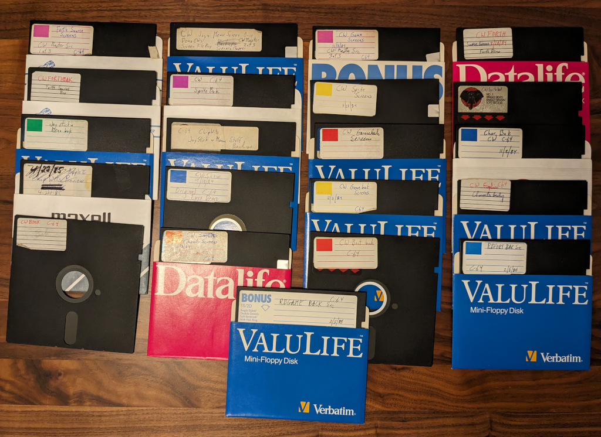
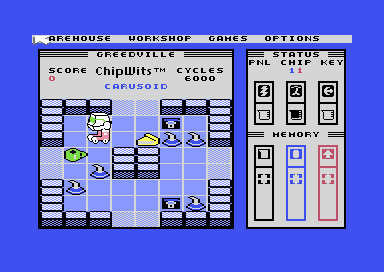

# ChipWits Commodore 64 Source Disks

This repository contains Commodore 64 raw disk images from the archives
of the original author of ChipWits, Doug Sharp.



# Screenshot



# Super Forth 64

By analyzing the disks, it's possible to infer that the game was built using a variant of the Forth programming
language called Super Forth 64, ranging from version 1.1.0 to version 2.1:

```bash
$ strings *.d64 | grep "SUPER-FORTH 64 V" | sort | uniq
             SUPER-FORTH 64 V 2.1 
     SUPER-FORTH 64 V 2.1
)!           SUPER-FORTH 64 V 2.1
H          SUPER-FORTH 64 V1.1.1
SUPER-FORTH 64 VERSION 1.1.0
SUPER-FORTH 64 VERSION 2.08
```

The disk images and user manual for Super Forth 64 can be found online:

* Super Forth 64 2.2R: http://www.vintagevolts.com/pages/commodore-64-file-downloads/?drawer=Programming
* User Manual: https://commodore.software/downloads/download/211-application-manuals/14011-superforth-64-user-manual

# Disks

The following disks have been restored. The folder names match the
labels on the disks.

These disks were imaged by John Morris, using Applesauce. The images are in the `.d64` format.

One of the challenges is, since there was no system time on the C64, there
are no timestamps on the disks. So it's hard to know which disk is the
latest version of the source code. We preserved the names on the labels of
the disks, which does help, somewhat.

| Disk                               | Notes                                                          |
|------------------------------------|----------------------------------------------------------------|
| Master 1of3 - Forth Source Screens |                                                                |
| Master 2of3 - CW Joy+Menu Screen   |                                                                |
| Master 3of3 - CW Game Screens      |                                                                |
| Joystick + Menu Stuff Backups      |                                                                |
| Char Bak 11-2-84                   |                                                                |
| CW Boot Bak                        | ChipWits Full Game Boot Disk 2 (see Boot Disk Backup 2, below) |
| CW Boot                            |                                                                |
| CW Sprite Bak                      |                                                                |
| Character Screens                  |                                                                |
| CW Forth 9-18-84                   | Source code to Epyx demo given on 9/18/1984                    |
| Game Bak Screens 11-3-84           |                                                                |
| Game Screens                       |                                                                |
| CW Graphics                        |                                                                |
| CW Show Original Epyx Demo 9-28-84 | Demo given to Epyx on 9/18/1984                                |
| CW Sprite Bak 2                    |                                                                |
| CW Sprite Screens                  |                                                                |
| CW Forth Bak                       |                                                                |
| Joystick + Menu Bak                |                                                                |
| RBFORT BAK Src 2-5-86              |                                                                |
| RBGAME BACK Src 2-5-86             |                                                                |

# Epyx Demo

On 9/18/1984, Doug Sharp and Mike Johnston gave a milestone update demo to
Epyx, the publisher for Commodore 64. The demo fits on a single disk and
can be loaded and run as follows:

1. Open the Vice 64 Emulator
2. Attach disk image `SUPER FORTH 64.d64` to Drive #8 (Obtainable via http://www.vintagevolts.com/pages/commodore-64-file-downloads/?drawer=Programming)
3. `LOAD "*", 8`
4. `RUN`
5. Attach disk image `CW Forth 9-18-84.d64` to Drive #8
6. `VARIABLE IT` (needed because the first statement is `FORGET IT : IT ;`)
7. `DR0 1 LOAD` (you may wish to activate Warp Mode during this step, as the loading will otherwise take about 6
minutes)
8. `CW.DEMO` (launches the demo)

# Boot Disk Backup 2

It's possible to run the full ChipWits game from Boot Disk 2. This seems to be running a compiled
version from the Forth environment. So you can list the dictionary and you can run Forth statements
but you cannot see the source code in this mode. I'm not sure if this is the final version of
the game, but it seems to run quite cleanly! 

1. Open the Vice 64 Emulator
2. Attach disk image `CW Boot Bak.d64` to Drive #8
3. `LOAD "GAME", 8` (warp mode recommended for this step)
4. `RUN` (this should launch Super Forth 64 v2.1)
5. `CHIPWITS` (starts the game!)

Instead of running `CHIPWITS` you can also run `VLIST` to list all the forth definitions.

# 11-3-84
In progress:
1. Configure the emulator for 2 1541 II drives.
2. Attach disk image `SUPER FORTH 64.d64` to Drive #8 (Obtainable via http://www.vintagevolts.com/pages/commodore-64-file-downloads/?drawer=Programming)
3. `LOAD "*", 8`
4. `RUN`
5. `CONFIGURE` (specify 2 drives - see page 25 of the Super Forth 64 manual - this allows screens 170+ to be loaded from drive 9)
6. Load definition for `$+`:
   1. Attach disk image `RBFORT BAK Src 2-5-86.d64` to Drive #8
   2. `DR0 7 LOAD`
   3. `DR0 8 LOAD`
   4. Need to define LR. Which screen?
7. Load definition for `CHAR>BUFFER`:
   1. Attach disk image `Char Bak 11-2-84.d64` to Drive #9
   2. `DR1 2 LOAD`
8. Attach disk image `Game Bak Screens 11-3-84.d64` to Drive #8
9. Attach disk image `Character Screens.d64` to Drive #9
10. `DR0 1 LOAD`

# Readable FORTH Source
The `forth/` directory contains extracts of the SUPER FORTH 64 source code, re-encoded so that
they can be read by a modern computer.


# Future Work

Further work needs to be done:
* catalog the latest version of the source code that is not corrupt
* assemble an ASCII listing of the complete latest source
* get the source for the full game to build and run
