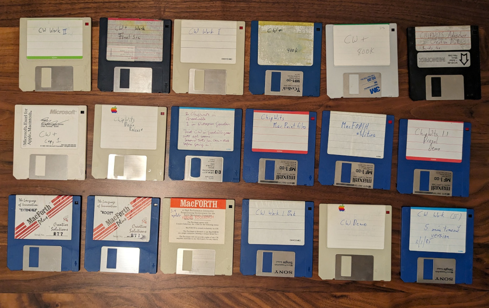

# ChipWits Macintosh Source Disks

This repository contains Macintosh raw disk images from the archives
of the original author of ChipWits, Doug Sharp.

# Screenshot

# MacForth

The source code for ChipWits was written in MacForth, a version of the Forth programming language.
This repository does not contain the MacForth compiler or runtime, but you can find more information
about MacForth at the [Macintosh Repository](https://www.macintoshrepository.org/49896-macforth-plus).

# Disks

The following disks have been restored. The filenames match the
labels on the disks.

The 800k disks were imaged using a PowerBook G3 WallStreet. The number of bad sectors is unknown,
but the OS did not report any issues with any of the disks.

The 400k disks were imaged with a [GreaseWeazel](https://decromancer.ca/greaseweazle/) and
[Fluxengine](https://cowlark.com/fluxengine/index.html). These disks had more bad sectors but
were still generally readable.

| Disk                                            | Notes                                                                                                                                             | Size | Bad Sectors |
|-------------------------------------------------|---------------------------------------------------------------------------------------------------------------------------------------------------|------|-------------|
| CW-source-from-fan.dsk                          | Disk provided by a fan of the game, to whom Doug gave a copy of the source code.                                                                  | 800k | ?           |
| CW 1.2 - CW Plus Work Final Src.dsk             | Final source code for ChipWits                                                                                                                    | 800k | ?           |
| Cw-plus-800k.dsk                                | Disk labeled CW+                                                                                                                                  | 800k | ?           |
| chipwits-in-greedville.dsk                      | Full label: 2 ChipWits in Geedville 1 in Octopus Garden First CW in Greedville goes into all rooms second tests for can and disk before going in. | 400k | 20          |
| CW 1.2 - CW Plus Work Final Src.dsk             |                                                                                                                                                   | 400k | 0           |
| chipwits-1.1-drexel-demo.dsk                    |                                                                                                                                                   | 400k | 22          |
| chipwits-adventure-creation-disk-sounds-too.dsk |                                                                                                                                                   | 400k | 37          |
| chipwits-demo-release.dsk                       |                                                                                                                                                   | 400k | 4           |
| chipwits-macpaint-files.dsk                     |                                                                                                                                                   | 400k | 9           |
| cw-demo.dsk                                     |                                                                                                                                                   | 400k | 82          |
| cw-plus.dsk                                     |                                                                                                                                                   | 400k | 1           |
| cw-plus-copy-1.dsk                              |                                                                                                                                                   | 400k | 2           |
| cw-work-1-bak.dsk                               |                                                                                                                                                   | 400k | 0           |
| cw-work-i.dsk                                   |                                                                                                                                                   | 400k | 17          |
| cw-work-ii.dsk                                  |                                                                                                                                                   | 400k | 30          |
| cw-work-ii-5-min-timeout-version-8-1-85.dsk     |                                                                                                                                                   | 400k | 99          |

# Opening the Disks

The disks can be opened in a Mac emulator such as [Mini vMac](https://www.gryphel.com/c/minivmac/).
You need to boot with a system disk first. Some of these disks have the system installed as well, others don't.

# Recovering Source
The `recovering/` directory contains semi-recovered source files, re-encoded so that they can be
read by a modern computer. They are non-normative and will not compile.
