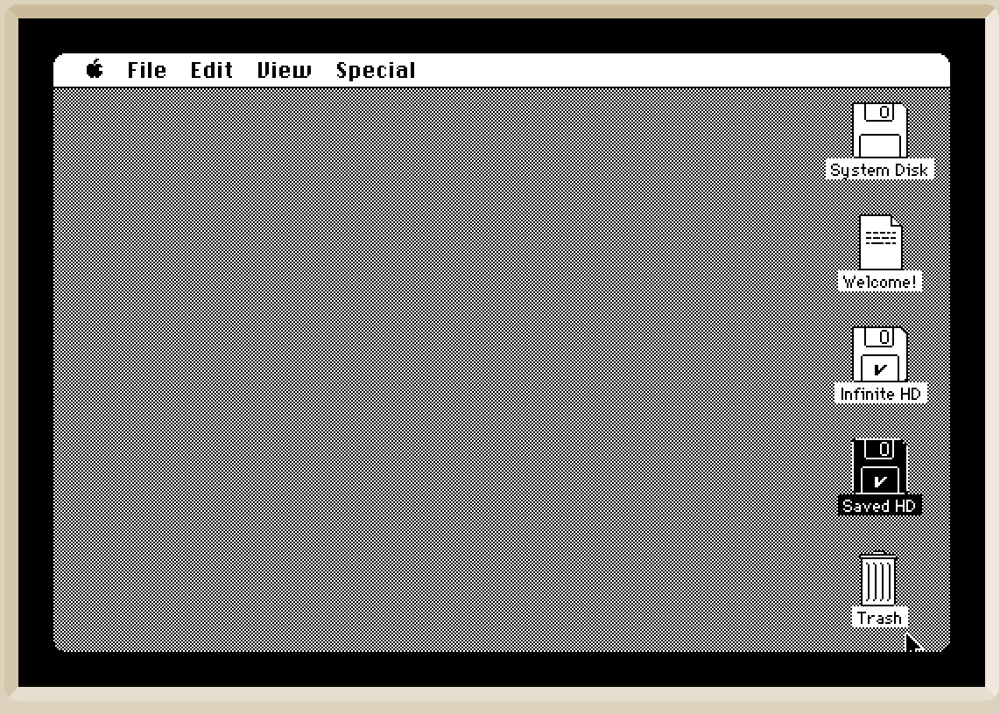
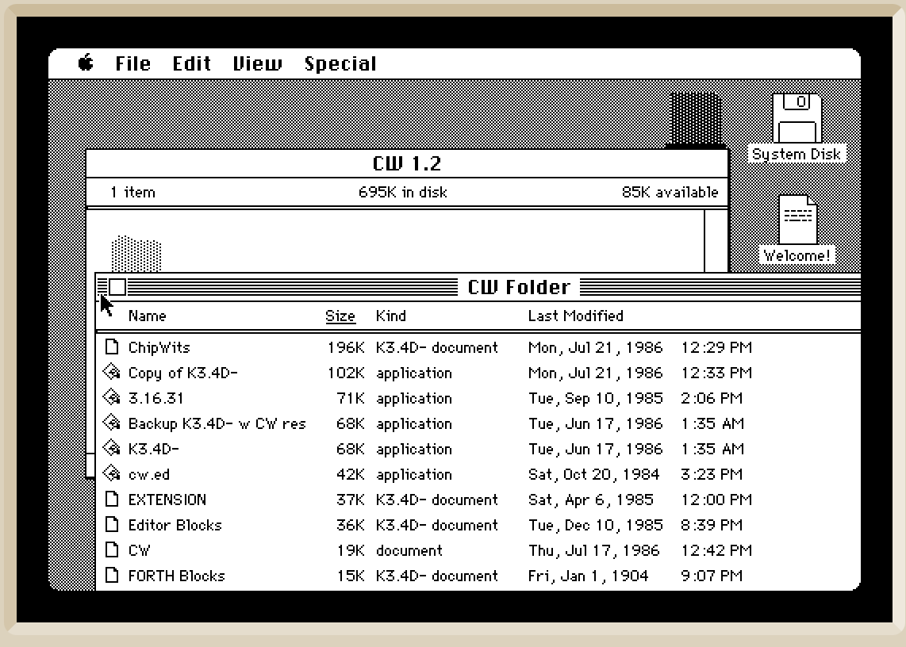
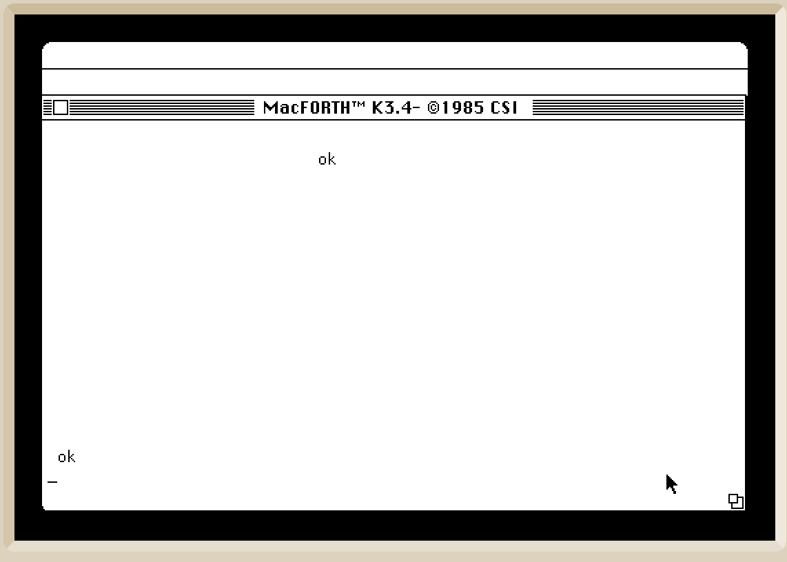
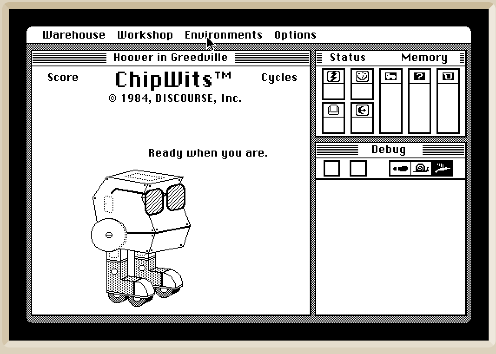

# Building ChipWits 1.2 for the Macintosh 128k

After a lot of reading and experimenting, I have now found a very easy way to build the Macintosh 128 version of ChipWits 1.2. This is the same version that runs in the emulator on the ChipWits website.

### Preparation:

Download the virtual disk containing the source code for the Macintosh 128 ChipWits version 1.2:

[GitHub Link](https://github.com/chipwits/chipwits-forth/blob/main/mac/disks/CW%2B%20Work%20Final%20Src/CW%2B%20Work%20Final%20Src.dc42)

Rename this disk image to, for example, **"CW+ Work Final Src.image"**.

Start the Macintosh emulator in the browser. You can find this emulator at:  
[Infinite Mac Emulator (System 2.1, 1985)](https://infinitemac.org/1985/System%202.1)

Wait until the emulator has fully started. The screen should look like the image below.

Drag and drop the virtual disk image (the one now named with the **.image** extension) onto the emulator.  
If everything has been done correctly, a window named **"CW Folder"** will open inside the emulator.

Double-click the file named **"ChipWIts"** (the first file in the folder).  
This will start the **MacForth** application, open the **Blocks file "ChipWIts"**, and begin compiling it.  
After compilation, the application will start automatically. This may take some time, and during compilation, the screen will turn almost completely white.

After waiting for a while, the screen will come back to life, and at the bottom, you will see **"ok"**.  

Now, click above the title bar that contains **"MacForth ..."**.  
Your self-built version of ChipWits will now start.

The version you just built is most likely **ChipWits 1.2**. I am still working on proving this, but this process is rather complex.
